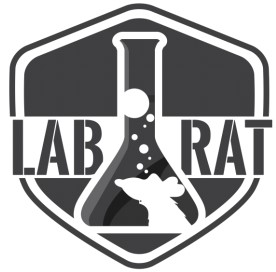

<h1 align="center">
  “...Welcome To The Lab, Pal.”
   
  
  
   
  Rick and Morty
   
  Show me what you got!
</h1>

<h4 align="center"> 
   Typescript
   React
   Sass
   Node
   Jest
</h4>

### Projeto criado para demonstração de conhecimentos e boas práticas de desenvolvimento como teste para o processo seletivo do Squad LabRat.

**Avaliação:**

Nós da Squad LabRat queremos ver o seu potencial por meio deste desafio, essa é sua oportunidade de mostrar seus conhecimentos e o que você sabe sobre boas práticas de desenvolvimento.

**Prazo de entrega:** 

7 dias

## Executando a aplicação

**Back-end (server):**

`yarn install` para instalar as dependências.

`yarn test` para rodar os testes.

`yarn start` para executar o servidor localmente em http://localhost:3333/
 
**Front-end (web):**

`yarn install` para instalar as dependências.

`yarn test`  para rodar os testes.

`yarn start` para executar localmente em http://localhost:3000/

## Application

## Instruções:
Utilize Javascript ou Typescript para desenvolver o seu desafio, no Back-end deve ser utilizado o Node e no Front-end React.

**Importante:**
 - Orientação a objetos.
 - Clareza e organização do código

**Diferencial:**
- A aplicação possuir testes no Back-end e Front-end
-  Arquitetura/Design interno da aplicação.
- Performance da aplicação.

## Desafio:
**Back-end**: 

Desenvolva uma API Rest que realize uma requisição para a [API do Rick and Morty](https://rickandmortyapi.com/) e faça o seguinte tratamento com o retorno:
Liste todos os personagens da espécie **"Human"** e localização **"Earth (C137)"**, com os seguintes dados:
- name
- status
- gender
- image
- episodes (lista com o nome dos episódios que o personagem aparece)

**Front-end**: 

Desenvolva uma SPA que consuma a sua API do Back-end e exiba todos as informações dos personagens retornados, sinta-se livre para montar o layout como desejar.
